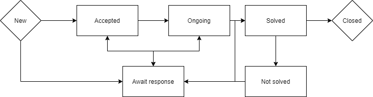

# flowchartEditor
A web UI where you can build simple flowcharts, and eventually export a logic based on that flowchart.

For example, a status flow chart:

And this user created chart should return data like:

Statuses
| id  | Description    | ActionType  |
|:---:|:--------------:|:-----------:|
| 1   | New            | New         |
| 2   | Accepted       | Accepted    |
| 3   | Ongoing        | Nothing     |
| 4   | Solved         | Solved      |
| 5   | Closed         | Closed      |
| 6   | Not solved     | Nothing     |
| 7   | Await response | Pause clock |

Relationships
| id  | from | to   |
|:---:|:----:|:----:|
| 1   | Null | 1    |
| 2   | 1    | 2    |
| 3   | 1    | 7    |
| 4   | 2    | 3    |
| 5   | 2    | 7    |
| 6   | 3    | 4    |
| 7   | 3    | 7    |
| 8   | 4    | 5    |
| 9   | 4    | 6    |
| 10  | 5    | null |
| 11  | 6    | 7    |
| 12  | 6    | 4    |